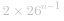
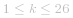
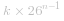
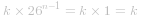
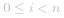
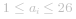
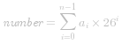
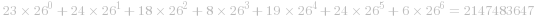
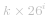

#### 方法一：进制转换

这道题要求将   表中的列名称转换成相对应的列序号。由于   表的列名称由大写字母组成，大写字母共有 *26* 个，因此列名称的表示实质是 *26* 进制，需要将 *26* 进制转换成十进制。

但是这道题和标准的进制转换不同，  表的列序号是从 *1* 开始的，因此在进制转换时需要进行处理。

当列名称的长度为 *n* 时，列名称的每个字母都有 *26* 种不同的取值，因此长度为 *n* 的不同列名称有 *26^n* 个。

当 *n=1* 时，列名称的取值范围是   到  ，分别对应 *1* 到 *26*。当 *n>1* 时，首先得到除了最高位以外的 *n-1* 位部分对应的列序号，然后考虑最高位对列序号的增量。

计算最高位对列序号的增量时，需要考虑列名称的长度和最高位的值，假设列名称的长度为 *n*。

- 当最高位是   时，除了最高位的 *n-1* 位有 *26^{n-1}* 种不同的取值，因此最高位   对列序号的增量为 *26^{n-1}*。

- 当最高位是   时，和最高位是   相比（即最高位从   变成  ，其余 *n-1* 位不变），列序号增加了 *26^{n-1}*，因此最高位   对列序号的增量为  。

- 当最高位是第 *k* 个字母时（ ），最高位对列序号的增量为  。

上述结论对 *n>1* 的情况都成立。当 *n=1* 时，*n-1=0*， ，因此 *n=1* 的情况也适用上述结论。

根据上述结论可知，列名称的每一位都会对列序号产生一个增量，列序号即为每一位的增量之和。如果列名称的每一位对应的序号为 ![\[a_{n-1},a_{n-2},\ldots,a_0\] ](./p___a_{n-1},_a_{n-2},_ldots,_a_0__.png) ，其中对于任意   都有  ，则列名称对应的列序号为：

 

以   为例，计算过程如下：

  中的每个字母对应的序号分别是：*[6,24,19,8,18,24,23]*（其中   到   分别对应 *1* 到 *26*），则列名称对应的列序号为：

 

由此可以得到如下实现：首先将列序号初始化为 *0*，然后从右往左遍历列名称，对于列名称的从右往左的第 *i* 位（ ），如果是第 *k* 个字母（ ），则将列序号的值增加  。遍历结束时即可得到列序号。

```Java [sol1-Java]
class Solution {
    public int titleToNumber(String columnTitle) {
        int number = 0;
        int multiple = 1;
        for (int i = columnTitle.length() - 1; i >= 0; i--) {
            int k = columnTitle.charAt(i) - 'A' + 1;
            number += k * multiple;
            multiple *= 26;
        }
        return number;
    }
}
```

```C# [sol1-C#]
public class Solution {
    public int TitleToNumber(string columnTitle) {
        int number = 0;
        int multiple = 1;
        for (int i = columnTitle.Length - 1; i >= 0; i--) {
            int k = columnTitle[i] - 'A' + 1;
            number += k * multiple;
            multiple *= 26;
        }
        return number;
    }
}
```

```JavaScript [sol1-JavaScript]
var titleToNumber = function(columnTitle) {
    let number = 0;
    let multiple = 1;
    for (let i = columnTitle.length - 1; i >= 0; i--) {
        const k = columnTitle[i].charCodeAt() - 'A'.charCodeAt() + 1;
        number += k * multiple;
        multiple *= 26;
    }
    return number;
};
```

```go [sol1-Golang]
func titleToNumber(columnTitle string) (number int) {
    for i, multiple := len(columnTitle)-1, 1; i >= 0; i-- {
        k := columnTitle[i] - 'A' + 1
        number += int(k) * multiple
        multiple *= 26
    }
    return
}
```

```C++ [sol1-C++]
class Solution {
public:
    int titleToNumber(string columnTitle) {
        int number = 0;
        long multiple = 1;
        for (int i = columnTitle.size() - 1; i >= 0; i--) {
            int k = columnTitle[i] - 'A' + 1;
            number += k * multiple;
            multiple *= 26;
        }
        return number;
    }
};
```

```C [sol1-C]
int titleToNumber(char* columnTitle) {
    int number = 0;
    long multiple = 1;
    for (int i = strlen(columnTitle) - 1; i >= 0; i--) {
        int k = columnTitle[i] - 'A' + 1;
        number += k * multiple;
        multiple *= 26;
    }
    return number;
}
```

```Python [sol1-Python3]
class Solution:
    def titleToNumber(self, columnTitle: str) -> int:
        number, multiple = 0, 1
        for i in range(len(columnTitle) - 1, -1, -1):
            k = ord(columnTitle[i]) - ord("A") + 1
            number += k * multiple
            multiple *= 26
        return number
```

**复杂度分析**

- 时间复杂度：*O(n)*，其中 *n* 是列名称   的长度。需要遍历列名称一次。

- 空间复杂度：*O(1)*。