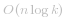

# 冒泡排序解法 (TLE)

每次调用 `add` 时先将数装入数组，然后遍历 `k` 次，通过找 `k` 次最大值来找到 Top K。

```java
class KthLargest {
    int k;
    List<Integer> list = new ArrayList<>(10009);
    public KthLargest(int _k, int[] _nums) {
        k = _k;
        for (int i : _nums) list.add(i);
    }
    public int add(int val) {
        list.add(val);
        int cur = 0;
        for (int i = 0; i < k; i++) {
            int idx = findMax(cur, list.size() - 1);
            swap(cur++, idx);
        }
        return list.get(cur - 1); 
    }
    int findMax(int start, int end) {
        int ans = 0, max = Integer.MIN_VALUE;
        for (int i = start; i <= end; i++) {
            int t = list.get(i);
            if (t > max) {
                max = t;
                ans = i;
            }
        }
        return ans;
    }
    void swap(int a, int b) {
        int c = list.get(a);
        list.set(a, list.get(b));
        list.set(b, c);
    }
}
```
* 时间复杂度：*O(nk)*
* 空间复杂度：*O(n)*

***

# 快速排序解法

上述的解法时间复杂度是 *O(nk)* 的，当 `k` 很大的时候会超时。

我们可以使用快排来代替冒泡。

将复杂度变为  ，不能说   复杂度一定比 *O(nk)* 要低，但   通常更加接近 *O(n)*。

本题的 `n` 的范围是 *10^4*，  解法的效率等于一个常数为 15 以内的 *O(n)* 算法：

```java
class KthLargest {
    int k;
    List<Integer> list = new ArrayList<>(10009);
    public KthLargest(int _k, int[] _nums) {
        k = _k;
        for (int i : _nums) list.add(i);
    }
    
    public int add(int val) {
        list.add(val);
        Collections.sort(list);
        return list.get(list.size() - k);
    }
}
```
* 时间复杂度： 
* 空间复杂度：*O(n)*

***

# 优先队列解法

使用优先队列构建一个容量为 `k` 的小根堆。

将 `nums` 中的前 `k` 项放入优先队列（此时堆顶元素为前 `k` 项的最大值）。

随后逐项加入优先队列：

* 堆内元素个数达到 `k` 个：

  * 加入项小于等于堆顶元素：加入项排在第 `k` 大元素的后面。直接忽略
  * 加入项大于堆顶元素：将堆顶元素弹出，加入项加入优先队列，调整堆

* 堆内元素个数不足 `k` 个，将加入项加入优先队列

将堆顶元素进行返回（数据保证返回答案时，堆内必然有 `k` 个元素）：

```java
class KthLargest {
    int k;
    PriorityQueue<Integer> queue;
    public KthLargest(int _k, int[] _nums) {
        k = _k;
        queue = new PriorityQueue<>(k, (a,b)->Integer.compare(a,b));
        int n = _nums.length;
        for (int i = 0; i < k && i < n; i++) queue.add(_nums[i]);
        for (int i = k; i < n; i++) add(_nums[i]);
    }
    public int add(int val) {
        int t = !queue.isEmpty() ? queue.peek() : Integer.MIN_VALUE;
        if (val > t || queue.size() < k) {
            if (!queue.isEmpty() && queue.size() >= k) queue.poll();
            queue.add(val);
        }
        return queue.peek();
    }
}
```
* 时间复杂度：最坏情况下，`n` 个元素都需要入堆。复杂度为  
* 空间复杂度：*O(k)*

***

# 最后

如果有帮助到你，请给个点赞关注 ~ ("▔□▔)/

我会在每完成一道题就写一篇题解，欢迎你来和我一起刷穿 LeetCode ~