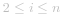
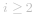

#### 方法一：动态规划

假设数组   的长度为 *n*，则 *n* 个阶梯分别对应下标 *0* 到 *n-1*，楼层顶部对应下标 *n*，问题等价于计算达到下标 *n* 的最小花费。可以通过动态规划求解。

创建长度为 *n+1* 的数组  ，其中 ![\textit{dp}\[i\] ](./p__textit{dp}_i__.png)  表示达到下标 *i* 的最小花费。

由于可以选择下标 *0* 或 *1* 作为初始阶梯，因此有 ![\textit{dp}\[0\]=\textit{dp}\[1\]=0 ](./p__textit{dp}_0_=textit{dp}_1_=0_.png) 。

当   时，可以从下标 *i-1* 使用 ![\textit{cost}\[i-1\] ](./p__textit{cost}_i-1__.png)  的花费达到下标 *i*，或者从下标 *i-2* 使用 ![\textit{cost}\[i-2\] ](./p__textit{cost}_i-2__.png)  的花费达到下标 *i*。为了使总花费最小，![\textit{dp}\[i\] ](./p__textit{dp}_i__.png)  应取上述两项的最小值，因此状态转移方程如下：

![\textit{dp}\[i\]=\min(\textit{dp}\[i-1\]+\textit{cost}\[i-1\],\textit{dp}\[i-2\]+\textit{cost}\[i-2\]) ](./p___textit{dp}_i_=min_textit{dp}_i-1_+textit{cost}_i-1_,textit{dp}_i-2_+textit{cost}_i-2____.png) 

依次计算   中的每一项的值，最终得到的 ![\textit{dp}\[n\] ](./p__textit{dp}_n__.png)  即为达到楼层顶部的最小花费。

```Java [sol1-Java]
class Solution {
    public int minCostClimbingStairs(int[] cost) {
        int n = cost.length;
        int[] dp = new int[n + 1];
        dp[0] = dp[1] = 0;
        for (int i = 2; i <= n; i++) {
            dp[i] = Math.min(dp[i - 1] + cost[i - 1], dp[i - 2] + cost[i - 2]);
        }
        return dp[n];
    }
}
```

```JavaScript [sol1-JavaScript]
var minCostClimbingStairs = function(cost) {
    const n = cost.length;
    const dp = new Array(n + 1);
    dp[0] = dp[1] = 0;
    for (let i = 2; i <= n; i++) {
        dp[i] = Math.min(dp[i - 1] + cost[i - 1], dp[i - 2] + cost[i - 2]);
    }
    return dp[n];
};
```

```C++ [sol1-C++]
class Solution {
public:
    int minCostClimbingStairs(vector<int>& cost) {
        int n = cost.size();
        vector<int> dp(n + 1);
        dp[0] = dp[1] = 0;
        for (int i = 2; i <= n; i++) {
            dp[i] = min(dp[i - 1] + cost[i - 1], dp[i - 2] + cost[i - 2]);
        }
        return dp[n];
    }
};
```

```Go [sol1-Golang]
func minCostClimbingStairs(cost []int) int {
    n := len(cost)
    dp := make([]int, n+1)
    for i := 2; i <= n; i++ {
        dp[i] = min(dp[i-1]+cost[i-1], dp[i-2]+cost[i-2])
    }
    return dp[n]
}

func min(a, b int) int {
    if a < b {
        return a
    }
    return b
}
```

```Python [sol1-Python3]
class Solution:
    def minCostClimbingStairs(self, cost: List[int]) -> int:
        n = len(cost)
        dp = [0] * (n + 1)
        for i in range(2, n + 1):
            dp[i] = min(dp[i - 1] + cost[i - 1], dp[i - 2] + cost[i - 2])
        return dp[n]
```

```C [sol1-C]
int minCostClimbingStairs(int* cost, int costSize) {
    int dp[costSize + 1];
    dp[0] = dp[1] = 0;
    for (int i = 2; i <= costSize; i++) {
        dp[i] = fmin(dp[i - 1] + cost[i - 1], dp[i - 2] + cost[i - 2]);
    }
    return dp[costSize];
}
```

上述代码的时间复杂度和空间复杂度都是 *O(n)*。注意到当   时，![\textit{dp}\[i\] ](./p__textit{dp}_i__.png)  只和 ![\textit{dp}\[i-1\] ](./p__textit{dp}_i-1__.png)  与 ![\textit{dp}\[i-2\] ](./p__textit{dp}_i-2__.png)  有关，因此可以使用滚动数组的思想，将空间复杂度优化到 *O(1)*。

```Java [sol2-Java]
class Solution {
    public int minCostClimbingStairs(int[] cost) {
        int n = cost.length;
        int prev = 0, curr = 0;
        for (int i = 2; i <= n; i++) {
            int next = Math.min(curr + cost[i - 1], prev + cost[i - 2]);
            prev = curr;
            curr = next;
        }
        return curr;
    }
}
```

```JavaScript [sol2-JavaScript]
var minCostClimbingStairs = function(cost) {
    const n = cost.length;
    let prev = 0, curr = 0;
    for (let i = 2; i <= n; i++) {
        let next = Math.min(curr + cost[i - 1], prev + cost[i - 2]);
        prev = curr;
        curr = next;
    }
    return curr;
};
```

```C++ [sol2-C++]
class Solution {
public:
    int minCostClimbingStairs(vector<int>& cost) {
        int n = cost.size();
        int prev = 0, curr = 0;
        for (int i = 2; i <= n; i++) {
            int next = min(curr + cost[i - 1], prev + cost[i - 2]);
            prev = curr;
            curr = next;
        }
        return curr;
    }
};
```

```Go [sol2-Golang]
func minCostClimbingStairs(cost []int) int {
    n := len(cost)
    pre, cur := 0, 0
    for i := 2; i <= n; i++ {
        pre, cur = cur, min(cur+cost[i-1], pre+cost[i-2])
    }
    return cur
}

func min(a, b int) int {
    if a < b {
        return a
    }
    return b
}
```

```Python [sol2-Python3]
class Solution:
    def minCostClimbingStairs(self, cost: List[int]) -> int:
        n = len(cost)
        prev = curr = 0
        for i in range(2, n + 1):
            nxt = min(curr + cost[i - 1], prev + cost[i - 2])
            prev, curr = curr, nxt
        return curr
```

```C [sol2-C]
int minCostClimbingStairs(int* cost, int costSize) {
    int prev = 0, curr = 0;
    for (int i = 2; i <= costSize; i++) {
        int next = fmin(curr + cost[i - 1], prev + cost[i - 2]);
        prev = curr;
        curr = next;
    }
    return curr;
}
```

**复杂度分析**

- 时间复杂度：*O(n)*，其中 *n* 是数组   的长度。需要依次计算每个   值，每个值的计算需要常数时间，因此总时间复杂度是 *O(n)*。

- 空间复杂度：*O(1)*。使用滚动数组的思想，只需要使用有限的额外空间。